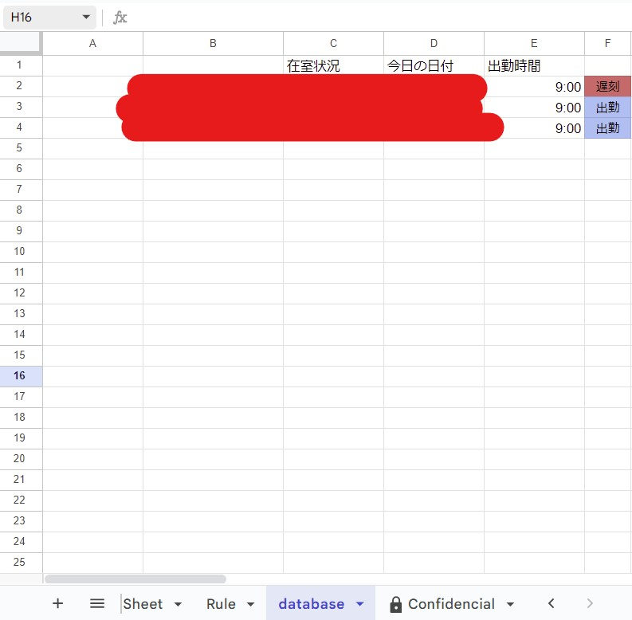
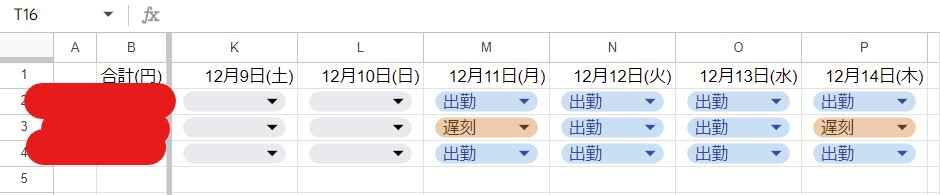

# AttendanceSpreadSheet

- 指定の時間（現在は9:00）になったら現在の出勤状況を別のスプレッドシートから参照して，時間までに出勤しなければ遅刻としてシートに書き出す
- ユーザーをRuleシートのD3セルから参照
- 月ごとで書きだすシートを分けるために，E3セルの現在の年月情報を取得
- 休日と祝日には作動しないようにした．
- Google App scriptの仕様上GUIからトリガー生成は1時間の間でランダムに作動するためTrigger.gsで指定した時間調度に作動するように変更
 
 ## 参照データシート
 
 
 ## 出勤遅刻管理シート
 
